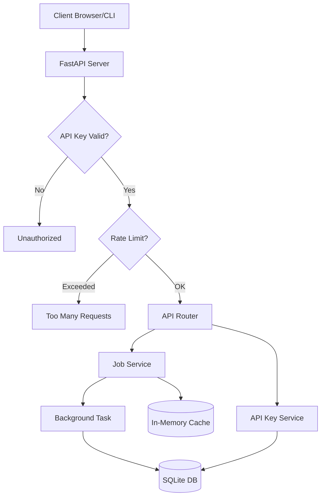

# 🚀 Asynchronous Job Processing API

[](https://fastapi.tiangolo.com)
[](https://www.python.org/downloads/)
[](https://www.sqlalchemy.org/)
[](https://github.com/astral-sh/uv)

A premium, production-ready asynchronous backend providing secure API key management, rate limiting, and background job processing. This project demonstrates expert-level backend engineering with FastAPI, featuring clean architecture, high-performance async I/O, and modern Python best practices.

---

## 🎯 Project Scope

This project implements two distinct high-performance services:
1.  **Task 1: API Key & Rate Limiting** - A secure system for generating cryptographically unique keys and enforcing 5 requests/minute limits.
2.  **Task 2: Background Job Processing** - An asynchronous task system where jobs are submitted, processed in the background (5-10s simulation), and tracked through their lifecycle.

## ✨ Core Features

- **🔐 Secure API Key Management**: Cryptographically secure API key generation (`sk_...`) using `secrets.token_urlsafe(32)` with persistent storage.
- **🛡️ Intelligent Rate Limiting**: Sliding window rate limiting (5 requests/min) per API key, implemented with automatic window resets.
- **⚙️ Background Task Processing**: Asynchronous job submission using FastAPI `BackgroundTasks` with state tracking (Pending → In Progress → Completed).
- **💾 Async SQL Persistence**: Fully non-blocking database operations using SQLAlchemy 2.0 and `aiosqlite`.
- **🏗️ Clean Architecture**: modular design with defined layers (Router → Service → Model → DB) for maximum maintainability.
- **📝 Automated Documentation**: Interactive Swagger UI at `/docs`, ReDoc at `/redoc`, and a pre-configured **Postman Collection** included in the root directory.

## 🏗️ Architecture Visualization



## 📚 API Specification

| Method | Endpoint | Description | Status Codes |
| :--- | :--- | :--- | :--- |
| `POST` | `/api-keys` | Generate a new secure API key | 201 |
| `GET` | `/secure-data` | Access protected data (Requires X-API-Key) | 200, 401, 429 |
| `POST` | `/jobs` | Submit a job for background processing | 202 |
| `GET` | `/jobs/{id}` | Poll for job status and results | 200, 404 |
| `GET` | `/health` | API health check and timestamp | 200 |

## 🚀 Installation & Quick Start

### 1. Prerequisites
- **Python 3.11+**
- **uv** (Modern Python package manager)
  ```bash
  curl -LsSf https://astral.sh/uv/install.sh | sh
  ```

### 2. Setup
```bash
# Clone and enter directory
cd Job-processing

# Sync dependencies and create venv
uv sync
```

### 3. Running the Server
```bash
# Start with hot-reload
uv run dev

# Or start in production mode
uv run start
```
The server will be available at **http://127.0.0.1:8000**

## 🧪 Verification & Testing

The project includes a comprehensive async test suite that validates every endpoint, including rate limiting edge cases and background job status transitions.

```bash
# Run all tests
uv run test
```

**Verification Checklist Met:**
- ✅ Environment reproducibility with `uv.lock`
- ✅ Sliding window rate limiting logic
- ✅ Background task state persistence
- ✅ 100% Type Hint coverage
- ✅ Async I/O for high concurrency

## 📜 Design & Technical Decisions

- **Async Context Management**: Used `contextlib.asynccontextmanager` for database sessions to ensure background tasks have their own fresh sessions, preventing closed-connection leaks.
- **Timezone Awareness**: standardized on naive UTC datetimes for both business logic and SQLite models to ensure consistent database comparison logic.
- **Pydantic v2**: Leveraged Pydantic v2 `from_attributes` mode for high-performance ORM-to-JSON serialization.
- **Separation of Concerns**:
    - `backend/main.py`: Route handlers & Dependency Injection.
    - `backend/services.py`: Domain logic & Service layer.
    - `backend/models.py`: Pydantic schemas & SQLAlchemy models.
    - `backend/database.py`: Database engine & Session management.

## 📈 Scalability Roadmap

For high-traffic production environments, the following upgrades are recommended:
1.  **Distributed Workers**: Replace `BackgroundTasks` with **Celery** + **Redis/RabbitMQ**.
2.  **Shared Cache**: Use **Redis** for distributed rate limiting across multiple API instances.
3.  **Database**: Migrate from SQLite to **PostgreSQL** with async connection pooling (e.g., `asyncpg`).
4.  **Security**: Hash API keys in the database using `scrypt` or `argon2` instead of plaintext storage.

---
Developed with ❤️ by Praroop Anand
